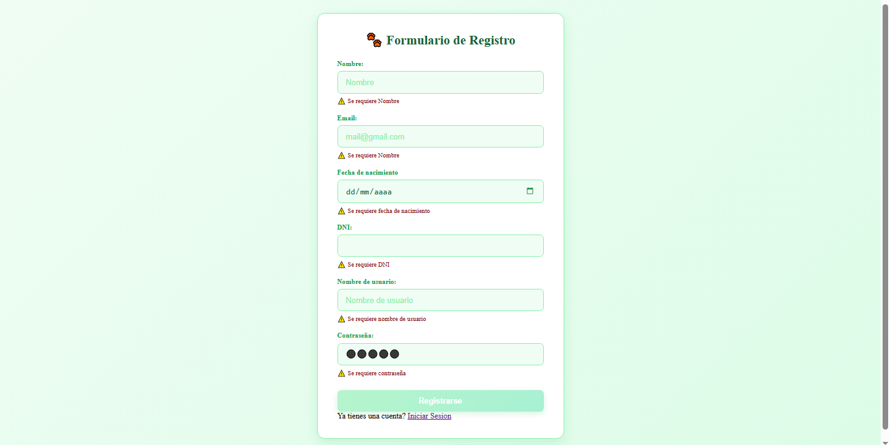
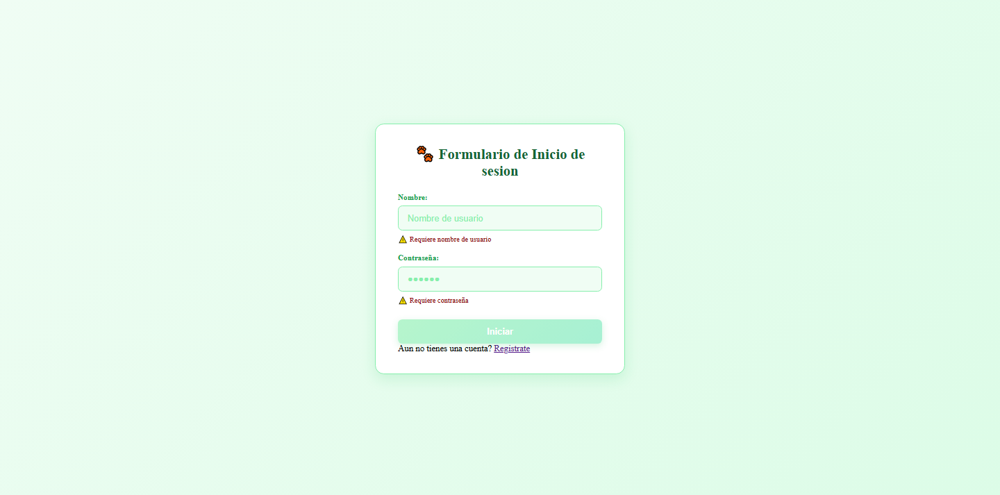
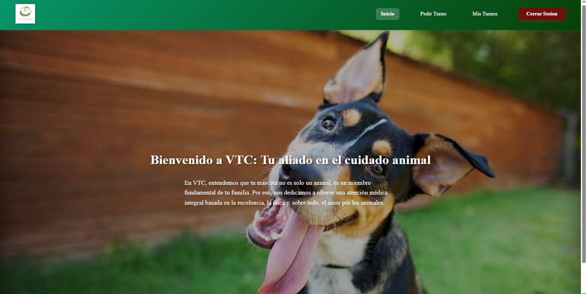
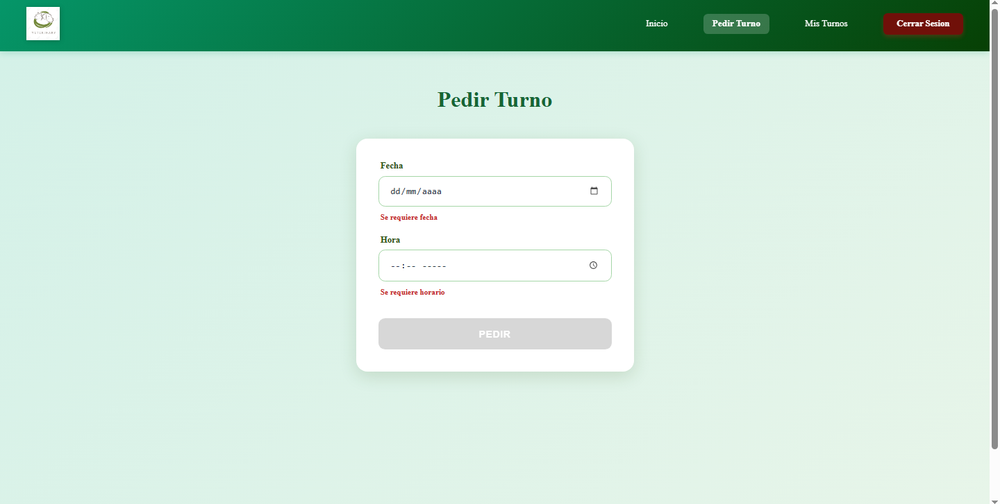
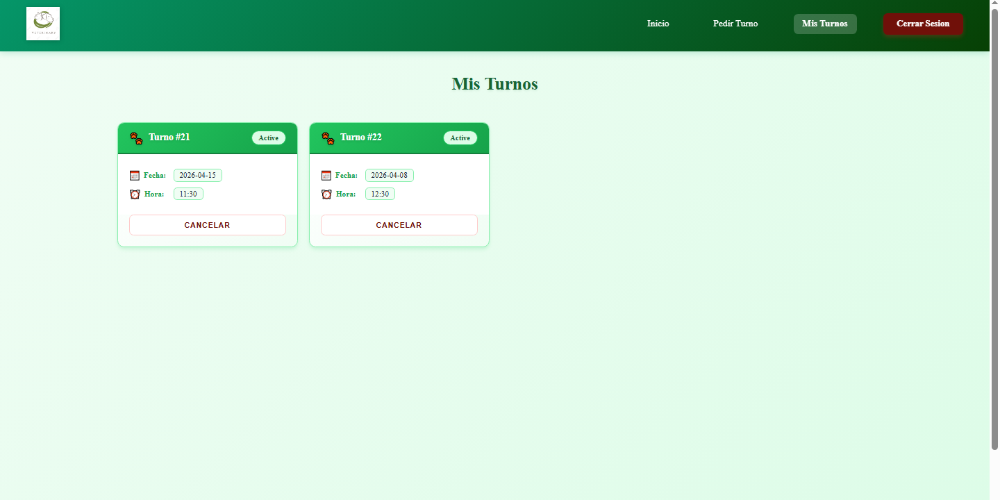

# 🐾 VTC: Veterinary Appointment Management System

**VTC (Tu aliado en el cuidado animal)** is a full-stack web application designed to streamline appointment scheduling for veterinary clinics. This project demonstrates a robust implementation of a **Relational Database (PostgreSQL)**, secure authentication, and a dynamic user interface.

---

## 🚀 Technical Highlights

* **Relational Architecture:** Implemented a `1:1` relationship between **Users** and **Credentials** for enhanced security and a `1:N` relationship between **Users** and **Appointments**.
* **Backend Logic:** Developed with **Node.js** and **Express/TypeScript**, utilizing **TypeORM** for database interactions and custom Data Transfer Objects (DTOs) for strict data validation.
* **Security:** Password hashing (SHA-256) and credential verification to ensure user data integrity.
* **Dynamic Frontend:** Built with **React** and **Vite**, featuring a responsive dashboard where users can view, schedule, and track their pets' medical appointments.

---

## 🛠️ Tech Stack

* **Frontend:** React, Vite, Redux (Global State), SweetAlert2.
* **Backend:** Node.js, TypeScript, TypeORM.
* **Database:** PostgreSQL.
* **Tools:** Git Bash, pgAdmin4, Postman.

---

### 📸 Preview

  
  
  
  
  

---

## 👤 Author
* **Itzel Godoy Lopez** - *Fullstack Developer Student*
